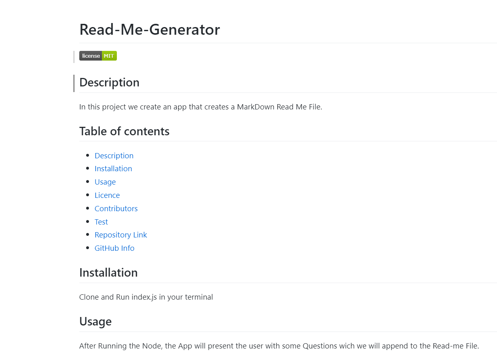

# **Read-Me-Generator**


## Description 
Read-Me-Generator is a Node.js App that creates a dynamic Read-Me file of the project where this node is executed. The file will be created in the folder where the node file is located.

## Table of contents
- [Description](#Description)
- [Installation](#Installation)
- [Usage](#Usage)
- [License](#License)
- [Repository Link](#Repository)
- [GitHub Info](#GitHub) 
## Installation
Suitable for all applications in GitHub. The node file will create a read-me file, with all the information of the repo and the user. Clone Repository, Run node index.js in the terminal          ```   $ npm install     ```
## Usage
After running the node file, the user is prompt with different questions about the repo file. Once we obtain the users GitHub username we execute an Axios function to the GitHub API to retrieve all the data from the user store in Github. 
## License
undefined
## Repository
- [Project Repo](https://api.github.com/users/Read-Me-Generator)
## GitHub

##
- [GitHub Profile](https://github.com/Asostoa)

